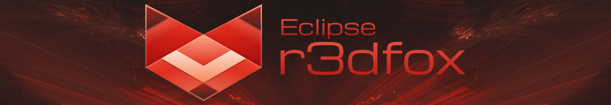

 

[Official Eclipse Community Discord Server](https://discord.gg/ecx)

Eclipse r3dfox is a fork of the Mozilla Firefox web browser made specifically for Windows Vista, 7, and 8 compatibility. We also have Extended Support Release and beta versions as well.

(r3dfox ESR image goes here once 140.9.0 is out because revamped branding) (Plasmafox 150 beta image goes here when it exists)

Limited compatibility with One Core API on Windows XP is offered at the current time, however this is not tested consistently. Any issues that may arise that are hard to diagnose may be left to the extended kernel provider to fix.

Local (GitHub) Downloads ([New Repo](https://github.com/Eclipse-Community/r3dfox)): 

Local (GitHub) Downloads ([Old Repo](https://github.com/Eclipse-Community/r3dfox-old)): 

SourceForge Downloads: 

## Features

- New default theme and color scheme!
- More native and native like elements, scrollbar, checkboxes, radio buttons, tooltips, and more!
- Windows theme version override, ability to use modern (Windows 10) theme on any OS, or enable (Windows 7) Aero theme on Windows 10!
- Full portable mode that doesn't touch AppData at all!
- Switchable Classic about:config page!
- Less telemetry than regular Firefox!
- No background tasks!
- Easier to notice red retry button for failed downloads!
- JPEG XL support!
- GPU/hardware acceleration in VMware Workstation 16 and above!
- general.useragent.override.(website) is back!
- Instant one off searches and classic one off search UI!
- Ability to restore classic right click menu items such as view image and text navigation buttons!
- Ability to disable CSP, CORS, HSTS, and SOP!
- Experimental (and kinda broken) ability to disable e10s (multiprocess), Skia, and DirectWrite!
- Other options including the ability to easily disable geolocation, Web Audio, tab groups, screenshot component, tab hover preview, drop to pin tabs, add tab to taskbar button, urlbar foratting, switch to tab behavior, and more!

## Credits

If I've forgotten to put your name here, please let me know and I'll add it.

- [e3kskoy7wqk](https://github.com/e3kskoy7wqk) - Windows Vista, 7, 8 and native controls support code!
- [3y4m4r1n](https://github.com/3y4m4r1n) - Helped fix the new JumpListBuilder crashing under Vista and 7.
- [Alex313031](https://github.com/Alex313031) - Mozconfig, general help with the browser, and changes from Mercury browser.
- [Feodor2](https://github.com/Feodor2) - Portable mode and more from Mypal68.
- [goodusername123](https://github.com/goodusername123) - Graphical acceleration in VMware Workstation.
- [ImSwordQueen](https://github.com/ImSwordQueen) - Switchable about:config and other tweaks from Nocturne browser.
- [leadweedy](https://github.com/leadweedy) - Improved active tab indicator from Firefox-Proton-Square.
- [Librewolf Developers](https://codeberg.org/librewolf) - Privacy tweaks from Librewolf.
- [Mozilla Developers](https://github.com/mozilla-firefox) - Firefox browser base.
- [QNetITQ](https://github.com/QNetITQ) - WaveFox theme.
- [Solinus](https://solinus.neocities.org/) - Branding visuals, icons and fancy text.
- [Tor Browser Developers](https://gitlab.torproject.org/tpo/applications/tor-browser) - Addon fix code from Tor Browser.

# Original repository readme

[Firefox](https://firefox.com/) is a fast, reliable and private web browser from the non-profit [Mozilla organization](https://mozilla.org/).

### Contributing

To learn how to contribute to Firefox read the [Firefox Contributors' Quick Reference document](https://firefox-source-docs.mozilla.org/contributing/contribution_quickref.html).

We use [bugzilla.mozilla.org](https://bugzilla.mozilla.org/) as our issue tracker, please file bugs there.

### Resources

* [Firefox Source Docs](https://firefox-source-docs.mozilla.org/) is our primary documentation repository
* Nightly development builds can be downloaded from [Firefox Nightly page](https://www.mozilla.org/firefox/channel/desktop/#nightly)

If you have a question about developing Firefox, and can't find the solution
on [Firefox Source Docs](https://firefox-source-docs.mozilla.org/), you can try asking your question on Matrix at
chat.mozilla.org in the [Introduction channel](https://chat.mozilla.org/#/room/#introduction:mozilla.org).
